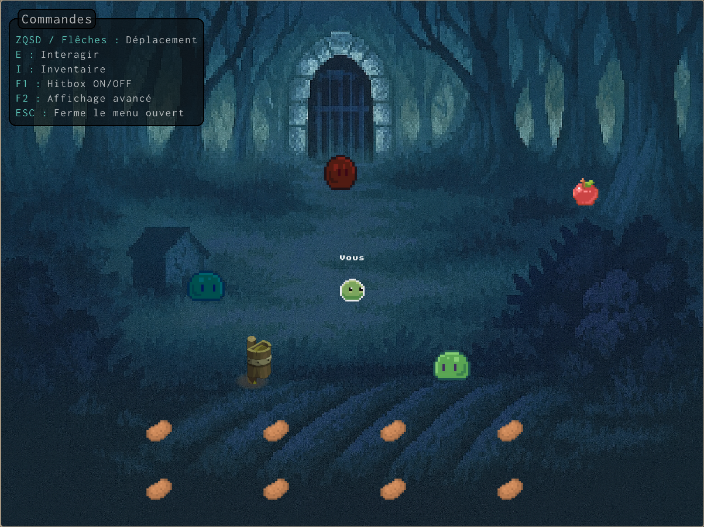
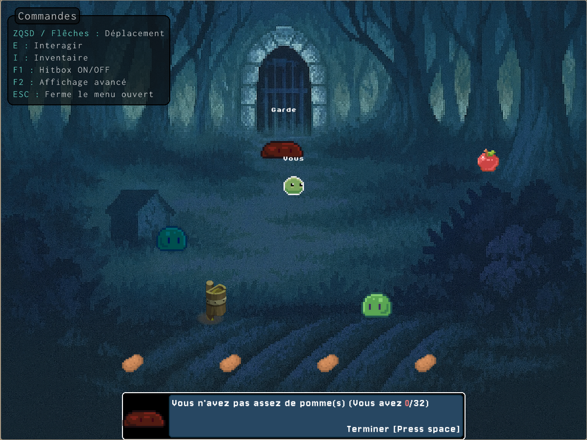
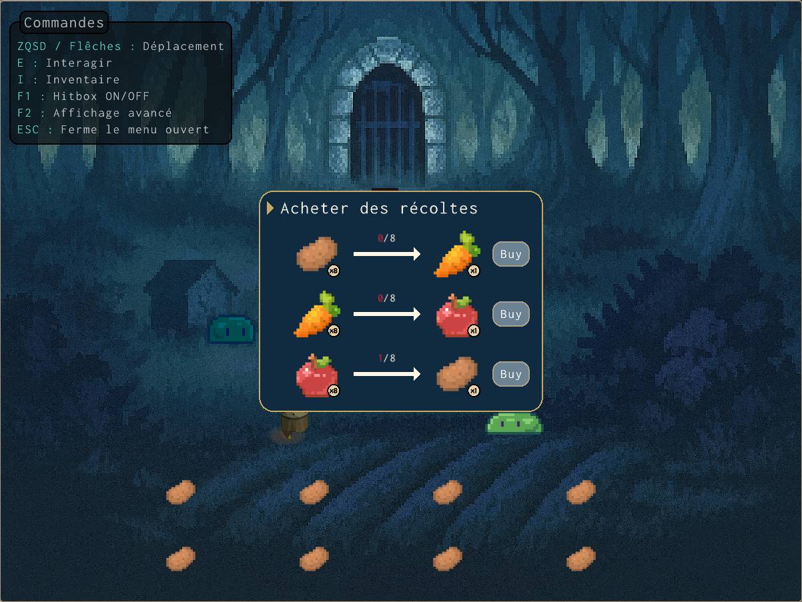
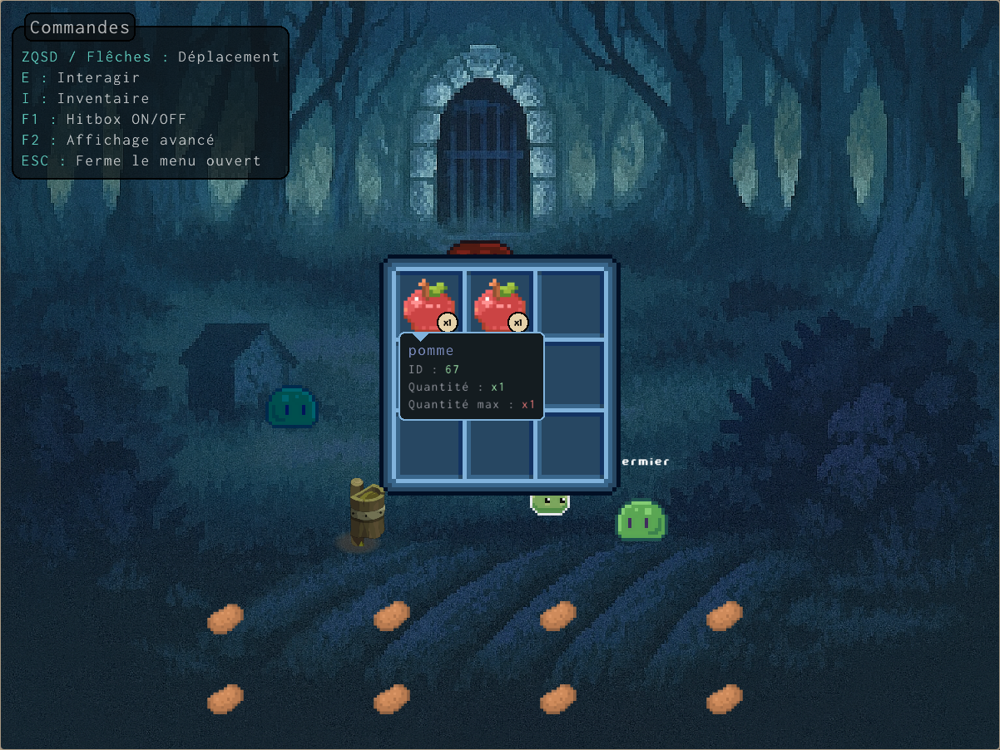
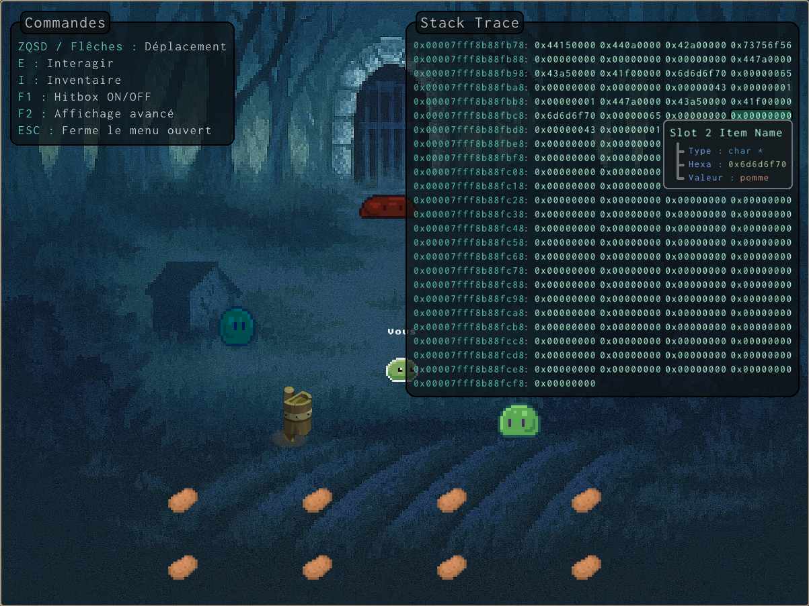
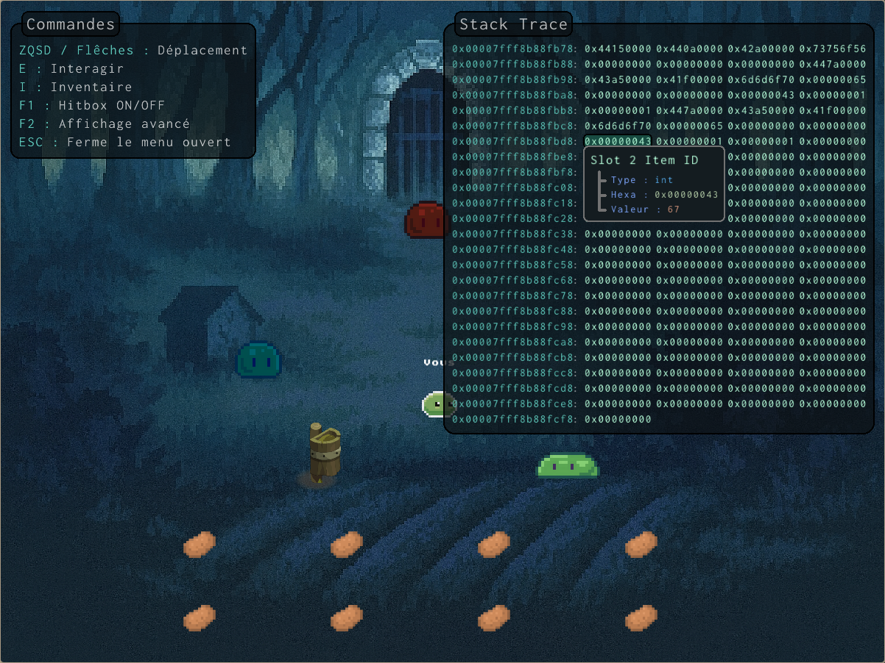
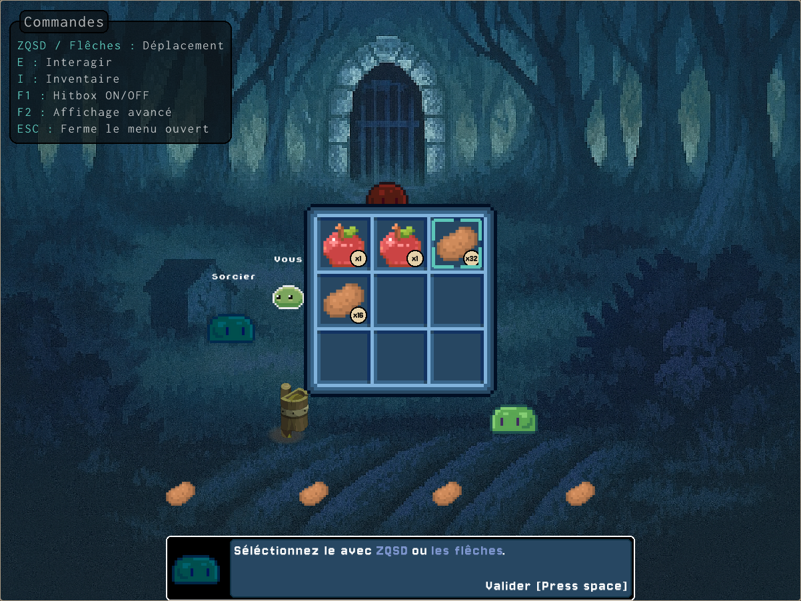
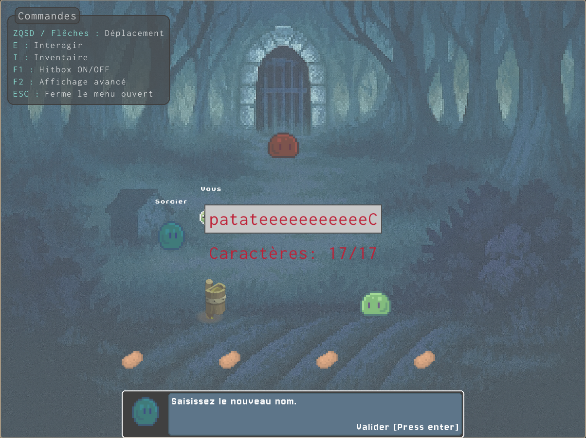
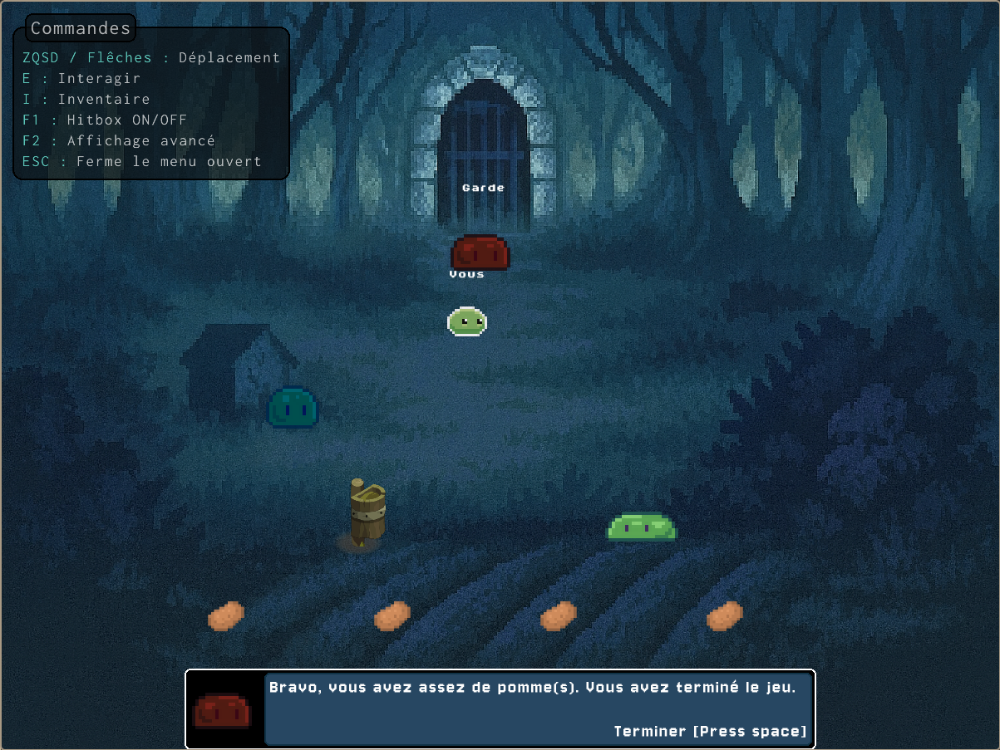

# BOF : L'objet Interdit


Un petit jeu en **C/C++ avec raylib** pour découvrir les **buffer overflows** de façon ludique et pédagogique.

## Concept

Vous incarnez un personnage pouvant parler à des PNJ, gérer un petit inventaire et tenter d’obtenir **L'Objet Interdit**.  
Le problème ? **L'Objet Interdit** est indispensable pour terminer le jeu, mais il semble impossible à récupérer en quantité suffisante par des moyens « normaux ».  
Saurez‑vous quand même finir le jeu ?

## Compilation & Exécution

```bash
# Cloner le dépôt
git clone https://github.com/IAidenI/bof-objet-interdit
cd bof-objet-interdit

# Compiler
make clean && make

# Lancer le jeu
./bofgame
```

**⚠️ ATTENTION : la taille de l'écran doit être au minimum de 1280x960**

## Objectif du joueur

- Explorer le jeu   
- Découvrir le bug  
- Terminer le jeu

## ⚠️ Avertissement

Ce projet contient volontairement une vulnérabilité à des fins **pédagogiques**. **Ne reproduisez pas** ces techniques sur des systèmes réels ou en production sans autorisation explicite. Utilisez ce projet uniquement pour apprendre et expérimenter dans un environnement contrôlé.

## Explication du Buffer Overflow

Le **buffer overflow**, ou dépassement de tampon, est l’une des vulnérabilités les plus anciennes et les plus exploitées. Que ce soit sur des serveurs ou des applications critiques, ses conséquences peuvent être dévastatrices.

Un dépassement de tampon se produit lorsqu’un processus écrit en dehors de la mémoire qui lui est allouée. Cela peut écraser des données cruciales ou être détourné pour modifier le comportement du programme. Dans certains cas, il est même possible d’exécuter du **code arbitraire**.

Dans ce projet, il s’agit simplement d’**écraser une valeur mémoire** pour modifier le comportement du programme.

## Résolution du Jeu

Le jeu commence par l’apparition d’un personnage dans un univers interactif.

<p align="center">
  
</p>

L’objectif, comme l’indique le garde, est de **récupérer 32 pommes**.

<p align="center">
  
</p>

Une première pomme est disponible à proximité, mais elle est **à usage unique**. En parlant au **fermier**, on découvre qu’il est possible d’**échanger des objets**.

<p align="center">
  
</p>

Les **patates**, disponibles en quantité illimitée, peuvent être échangées contre des **carottes**, puis ces dernières contre des **pommes**. Toutefois, en consultant l’inventaire :

<p align="center">
  
</p>

On constate que **chaque slot est limité à 1 objet**, et il n’y a que 9 slots disponibles. Impossible donc d’obtenir 32 pommes de manière légitime.

## Exploitation

En affichant la **stack**, on remarque que le **nom de l’objet** et son **ID** sont stockés côte à côte :

<p align="center">
  
  
</p>

Cela signifie qu’un **dépassement du champ du nom** permet d’écraser l’ID. Grâce au **sorcier**, on peut **modifier le nom d’un objet**.

On sait que l’ID de la pomme est **67**, ce qui correspond à **'C'** en ASCII ([référence](https://www.ascii-code.com/fr)).

<p align="center">
  
  
</p>

On peut entrer **17 caractères**, alors que seulement **16 sont alloués** pour le nom. Le 17e caractère écrasera donc l’ID si l’application n’effectue pas de vérification.

Une fois le nom modifié avec un suffixe `'C'`, on constate que l’ID a changé, et l’objet est reconnu comme une **pomme**. Il est ainsi possible d’en accumuler 32 dans l’inventaire et de terminer le jeu.

<p align="center">
  
</p>

## ✅ TODO

- Ajouter un système de profondeur visuelle : plus le Y du personnage diminue, plus sa taille devrait diminuer, afin de simuler un effet de perspective.

